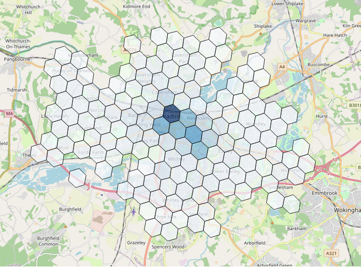
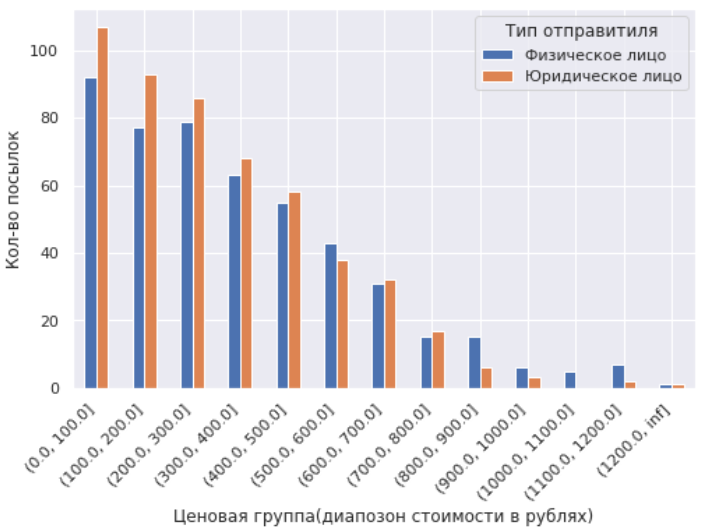
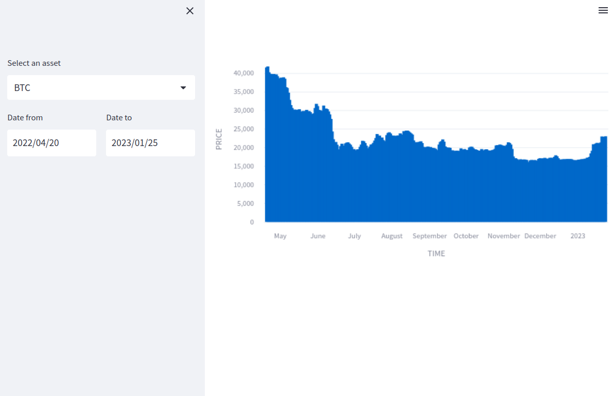
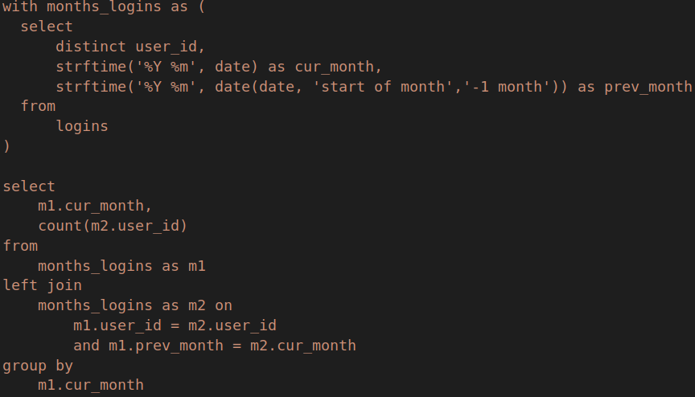

# Test assignments for Data/Product Analyst position

<table>
<thead>
<tr>

[//]: # (<th colspan="2">Projects info</th>)
</tr>
</thead>
<tbody>
<tr><th>Preview</th><th>Description</th></tr>

<tr><td>

</td>
<td>
Test assignment for the product analytics team, Gett. Analysis of dataset with failed trips (cancelled orders)

<a href="https://github.com/bebyakinb/test_assignments_Analyst/blob/master/gett/matching_home_assignment_for_candidates.ipynb">
Project code
</a>
</td></tr>

<tr><td>

</td>
<td>
Test assignment to test the knowledge of SQL. Solved with SQL and also with Pandas

<a href="https://github.com/bebyakinb/test_assignments_Analyst/blob/master/postal/postal_service.ipynb">
Project code
</a>
</td></tr>

<tr><td>

</td>
<td>
Test assignment for the position of Junior Analyst at Saber Interactive. 2 solved SQL problems and <a href="https://habr.com/ru/company/dcmiran/blog/500360/">interactive dashboard app(Python, streamlit)
</a>

<a href="https://github.com/bebyakinb/test_assignments_Analyst/blob/master/Saber">
Project code
</a>
</td></tr>

<tr><td>

</td>
<td>
<a href="https://habr.com/ru/company/dcmiran/blog/500360/">
The best medium difficulty SQL questions in a data analyst interview
</a>

<a href="https://github.com/bebyakinb/test_assignments_Analyst/blob/master/habr/The_best_medium_difficulty_SQL_interview_questions.ipynb">
Project code
</a>
</td></tr>

</tbody>
</table>
